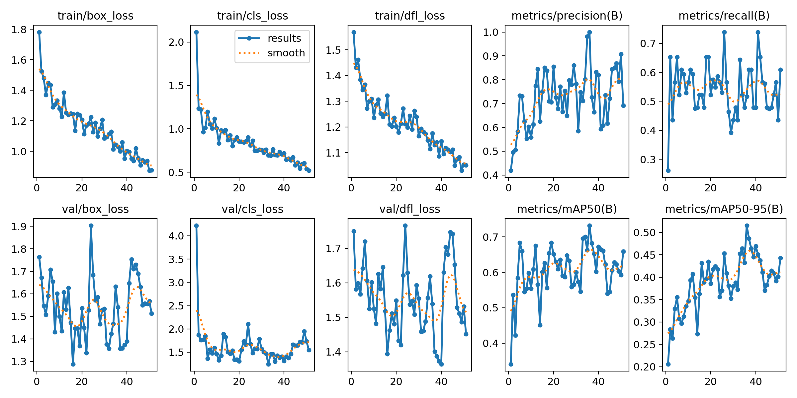
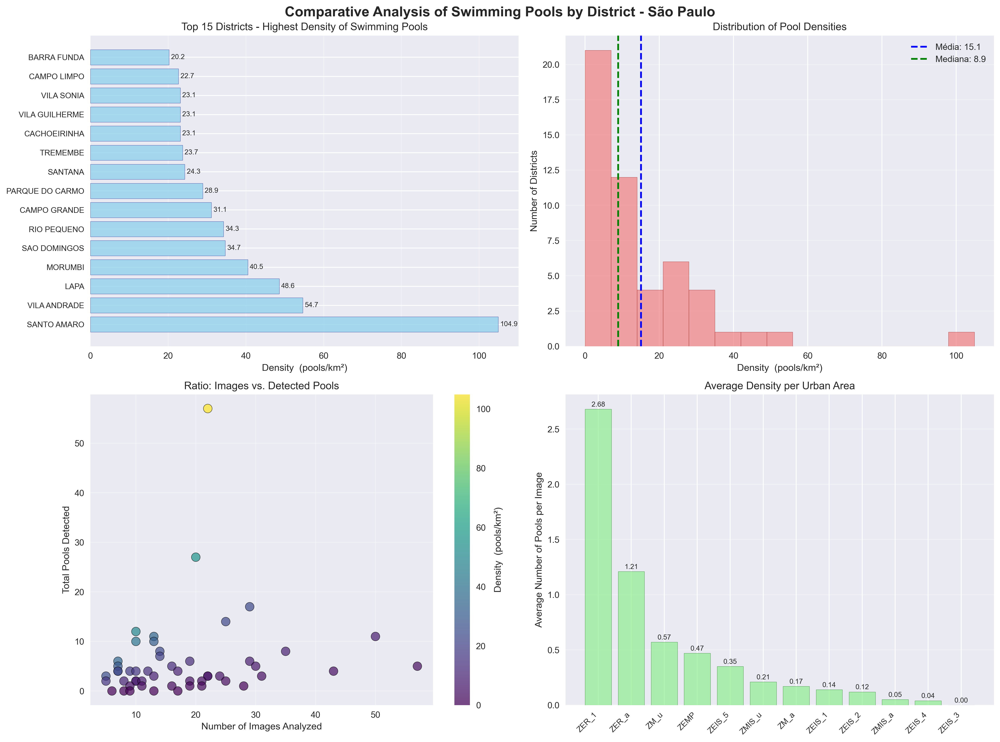
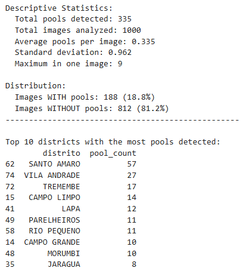

# 🏊‍♂️ CloudWalk Case - Swimming Pool Detection in São Paulo

## 📋 About the Project

This project uses **Machine Learning** and **satellite image analysis** to estimate the total number of swimming pools in the city of São Paulo. The methodology combines automatic detection with YOLOv8m model, systematic geospatial sampling, and robust statistical extrapolation.


### 🎯 Main Objective
**Estimate how many swimming pools exist in São Paulo** using computer vision and geospatial analysis techniques.

### 🏆 Final Result
**Total predicted swimming pools in São Paulo: ~6.790 ± 332**

**mAP50 = ~73.1%**

**mAP50-95 = ~51.5%**




---

## 🚀 How It Works

The project is divided into sequential stages, reflected in the Jupyter notebooks:

1.  **Notebook 1: Initial Training (French Dataset)**
    * A YOLOv8m model was initially trained using a public Kaggle dataset ([Swimming Pool 512x512](https://www.kaggle.com/datasets/alexj21/swimming-pool-512x512/data/code)), containing mostly images from France. This served as a pre-trained base model.

2.  **Notebook 2: Image Collection and Labeling (Brazil - SP)**
    * **Image Extraction:** Satellite images were collected via Google Maps Static API.
        * *(Demonstrated Reasoning)* An initial attempt with purely random sampling in SP was discarded due to low image quality (many forests/roads).
        * **Directed Sampling (for Fine-Tuning):** Specific neighborhoods with different expected pool density were selected (e.g., Morumbi, Jardim Paulista, Cidade Jardim) to create a focused and highly relevant dataset.
    * **Manual Labeling:** The collected SP images were **manually labeled** (bounding boxes on pools) using the Label Studio tool.

3.  **Notebook 3: Fine-Tuning (Adaptation to Brazil)**
    * The model trained in Stage 1 was **fine-tuned** using the custom dataset of São Paulo images labeled in Stage 2. The goal was to adapt the model to the specific visual characteristics of the Brazilian context.

4.  **Notebook 4: Final Sampling, Prediction and Analysis**
    * **Sampling Area Definition:**
        * Official shapefiles from **SP Districts** and **Zoning (LPUOS)** were used.
        * The zoning map was used to **filter and select only urban areas** (residential/mixed), excluding large green or industrial areas to optimize sampling.
    * **Sampling Points Generation:**
        * **1000 samples (lat/lon points)** were generated within these filtered areas.
        * The distribution of samples followed a **proportional distribution by district area**: larger districts received more points within their respective filtered residential/mixed areas.
        * An interactive map (Folium) was generated to visualize the spatial distribution of these 1000 points.
    * **Final Image Collection:** Satellite images were downloaded via Google Maps API for the 1000 generated points.
    * **Prediction and Counting:** The **fine-tuned** model (Stage 3) was used to detect and count pools in the 1000 sampled images.
    * **Analysis and Extrapolation:** The counting results were processed to:
        * Calculate the average pool density per km² (in sampled areas).
        * Extrapolate this density to estimate the total number of pools in SP.
        * Generate density comparisons between districts.

---

## 📁 Project Structure

```
CloudWalk-case/
├── 📁 notebooks/                     # Main Jupyter notebooks
│   ├── 📓 01_training_first_model.ipynb    # Initial training (Kaggle dataset)
│   ├── 📓 02_collect_sp_images.ipynb       # SP image collection + Label Studio
│   ├── 📓 03_fine_tuning_model.ipynb       # Fine-tuning for Brazil
│   └── 📓 04_pool_detection_and_counting.ipynb  # Final analysis
├── 📁 dataset/                       # Training datasets
│   ├── 📁 pools/                           # Kaggle dataset (France)
│   ├── 📁 sp-pools/                        # SP dataset (manually classified)
│   ├── 📁 sao_paulo_random_images/         # Random images (1st attempt)
│   ├── 📁 sao_paulo_sequential_images/     # Rich neighborhood images (2nd attempt)
│   └── 📁 yolo_dataset_split/              # Train/val/test split (70-15-15)
├── 📁 data/                          # Project data
│   ├── 📁 district_map/                    # SP district shapefiles
│   ├── 📁 final_pool_counts/               # Final detection results
│   ├── 📁 predict_images/                  # Images for prediction (1000 points)
│   ├── 📁 Mapa-1-SHP/                      # SP urban zones (zoning)
│   └── 📁 sao_paulo/                       # Images collected for fine-tuning
├── 📁 models/                       # Trained models
│   ├── 📁 results_pools/                   # Base models (France)
│   └── 📁 fine_tuning/                     # Fine-tuned models (Brazil)
├── 📁 results/                      # Results and visualizations
│   ├── 📁 predict_results/                 # Images with detections
│   ├── 📁 sp_extract_images/               # Sampling maps
│   └── 📄 *.png                            # Charts and analyses
├── 📄 README.md                     # This file
├── ⚙ .env                          # .env file
├── 📄 interactive_sample_map.html     # Interactive Folium map of sampling points
└── 📄 interactive_map_density_swimming_pools.html # Interactive Folium map of swimming pool density in São Paulo
```


## 📊 Methodology

### 1. **Initial Model Training**
- **Base Dataset:** Kaggle swimming pool dataset (France) - https://www.kaggle.com/datasets/alexj21/swimming-pool-512x512
- **Model:** YOLOv8m
- **Dataset Split:** 70% Training, 15% Validation, 15% Test
- **Performance:** mAP > 0.65 ✅

### 2. **São Paulo Image Collection**
- **Strategy 1:** Random sampling (demonstration of reasoning)
- **Strategy 2:** Focus on specific neighborhoods (Morumbi, Jardim Paulista, Cidade Jardim)
- **Tool:** Google Maps API for satellite image collection
- **Classification:** Label Studio for manual pool annotation


### 3. **Model Fine-tuning**
- **Base:** Model trained with images from France (Kaggle)
- **Adaptation:** Fine-tuning with specific images from Brazil
- **Dataset:** 307 manually classified São Paulo images
- **Dataset Split:** 70% Training, 15% Validation, 15% Test
- **Goal:** Adapt the model to Brazilian characteristics


### 4. **Final Systematic Sampling**
- **Points:** 1,000 points distributed proportionally by district
- **Coverage:** 96 districts of São Paulo
- **Focus:** Urban zones (avoiding forests and roads)
- **Method:** District shapefiles + zoning map
- **Visualization:** Folium map of selected points

---




## 🗺️ Implemented Features

### ✅ **Main Features**
- Automatic pool detection with YOLO
- Systematic geospatial sampling
- Robust statistical extrapolation
- Analysis by district and urban zone

### 🎁 **Bonus Features**
- **Interactive map** with Folium and density heatmap
- **Comparative analysis** by district with visualizations
- **Multiple methods** of statistical extrapolation
- **Complete validation** of results

---

## 📈 Main Results

### 🏆 **Top 5 Districts with Highest Density:**
1. **Santo Amaro:** 57 pools detected
2. **Vila Andrade:** 27 pools detected
3. **Tremembé:** 17 pools detected
4. **Campo Limpo:** 14 pools detected
5. **Lapa:** 12 pools detected

### 📊 **Quality Statistics:**
- **Districts with reliable sampling:** 45 districts (≥10 images)
- **Coverage:** 96 districts of São Paulo
- **Pool detection rate:** 18.8%



---

## 🔍 Validation and Limitations

### ✅ **Strengths:**
- Robust scientific methodology
- Multiple validation methods
- Comprehensive city coverage
- Model with validated performance (mAP > 0.65)

### ⚠️ **Identified Limitations:**
- Sampling focused on residential areas
- Detection limited to satellite images
- Seasonal variation not considered
- Image quality may vary between regions

---

## 📁 Generated Files

- `data/final_pool_counts/results.csv` - Complete detection results
- `data/mapa_densidade_piscinas_interativo_melhorado.html` - Interactive map
- `results/district_comparison_analysis.png` - Comparative analysis
- `data/mapa_amostragem_interativo.html` - Sampling points map

---

## 🛠️ Technologies Used

- **Python 3.10**
- **YOLOv8** (Ultralytics)
- **PyTorch** (Deep Learning)
- **GeoPandas** (Geospatial analysis)
- **Folium** (Interactive maps)
- **Google Maps API** (Satellite images)
- **Matplotlib/Seaborn** (Visualizations)
- **Scipy** (Statistics)
- **OpenCV** (Computer Vision)


---

## How to Run the Project

### 📋 Prerequisites

```bash
# Python 3.10+
pip install ultralytics
pip install geopandas
pip install folium
pip install matplotlib
pip install seaborn
pip install scipy
pip install pandas
pip install numpy
pip install requests
pip install pillow
pip install tqdm
pip install python-dotenv
```

### 🔑 API Configuration

1. **Get Google Maps API key:**
   - Access: https://console.cloud.google.com/
   - Create a new project
   - Enable "Maps Static API"
   - Go to "Credentials" > "Create credentials" > "API key"

2. **Configure .env file:**
   ```bash
   # Create a .env file in the project root
   GOOGLE_API_KEY="your_key_here"
   ```

### 🏃‍♂️ Execution

```bash
# 1. Clone the repository
git clone https://github.com/caio-torres-seares/CloudWalk-case.git
cd CloudWalk-case

# 2. Install dependencies
pip install -r requirements.txt

# 3. Run notebooks in order:
jupyter notebook notebooks/01_training_first_model.ipynb
jupyter notebook notebooks/02_collect_sp_images.ipynb
jupyter notebook notebooks/03_fine_tuning_model.ipynb
jupyter notebook notebooks/04_pool_detection_and_counting.ipynb
```

---


## 📄 License

This project is for educational use and technical demonstration.


